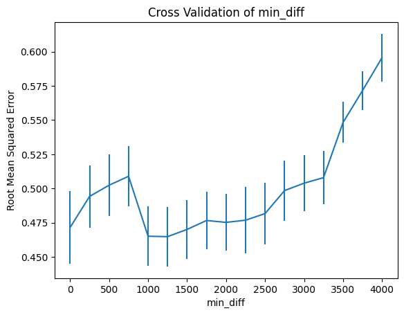
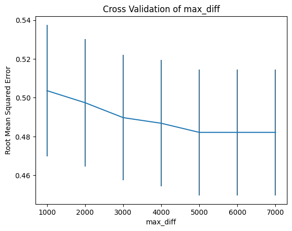

# Airbnb Listing Rating Prediction Model

This report evaluates the feasibility of predicting for a given Airbnb listing the following ratings: overall
rating, location, accuracy, cleanliness, check-in, value and communication ratings.

The two approaches I will be taking to predicting the ratings will be:
- Natural Language Processing (NLP) on the reviews to predict the overall rating
- A Regression Model to predict the communication rating using several feature variables.

For both approaches my aim was to replicate and predict the exiting rating data as close as possible.

</img>

## Approach 1: Predicting Listing Rating using NLP

### Feature Extraction

To predict the overall rating I used the comments from the ratings dataset. Although the overall rating should really take into account as many variables as possible, I thought it would be interesting to see how well the comments alone would work. My hypothesis being that there should be a strong correlation between the words used in reviews that gave positive comments and high ratings and vise versa.

To clean the data I removed any listings that had either no comments or no overall review score.
I joined all the comments for each listing into one string and merged that data-frame of comments
with the data-frame of ratings. The raw text data cannot be used as training input to the model as it
expects numerical feature vectors. To extract features from the data I used bag of words model which
includes uses both tokenization and occurrence counting. To implement these techniques I used the
”TfidfVectorizer” class provided by scikit-learn. I set the vectorizer to remove all capital letters, all
punctuation and extracted all words of at least two letters, which removes all words with only one letter
such as ”a” and ”I”. I preserved some context by also extracting 3-grams of words (Treating three and
two adjacent words as one new word). Each extracted word is then given a unique integer index. The
vectorizer then performs occurrence counting which simply counts the number of occurrences of each
word.

Using the hyper-parameters min diff and max diff I removed the words that appeared too frequently
or infrequently. The aim is to remove filler words or typos. As can be seen from the word cloud, it
would remove words such as stay, place, Dublin and br. We used cross-validation to determine the
best values for each. The graphs below show the results of cross validation on both parameters. Based on
these results. I decided to use a min diff value of 1000 and a max diff value of 5000.

</img>
</img>

### Machine Learning Methodology
For the machine learning model I first used a dummy regression model to get a baseline metric. I
then tested Linear Regression, Random Forest Regression, Ridge Regression and Lasso Regression.
For each of these I adjusted the hyper-parameters so that the model performed optimally. For Ridge
regression a very low C value of 1, performed best, whereas for Lasso Regression a much higher C
value of 200 was optimal. For Random Forest Regression 20 seemed like an appropriate number of
estimators to use and 25 seemed like an appropriate depth to search at.
Figure 5: Cross Validation of Hyper-Parameters for Ridge, Lasso and Random Forest Regression
### Evaluation / Visualisation
Using the optimal hyper-parameters found in the previous section, table 1 shows how each model
performs on the data. The root mean squared (RMSD) and mean squared (MSD) show the variation
of the data over the prediction. The R2score is the coefficient of determination and describes the
variation in the dependent variable (overall rating) that is predicable from the independent variables
(The feature variables). All of the models were able to outperform the dummy model which is good.

### Various Regression Models' Metrics

|     | Std | R2Score | T1 | T2 |
| :--------: | :-------: | :-------: | :-------: | :-------: |
Dummy Regression (mean)| 0.78 |0.044 |-0.0004 |0.5s| 0.1s|
Linear Regression |0.68 |0.02 |0.24 |0.2s |0.6s|
Ridge (C=1)| 0.51 |0.013| 0.55| 0.8s| 0.1s|
Lasso (C=500)| 0.51| 0.014 |0.57 |2.1s| 2.5s|
Random Forest (estimators=20,depth=25)| 0.43| 0.046| 0.009| 34.9s| 34.8s|

The Random Forest model performed the best, this is because it is typically better when it comes to
data that does not follow a normal curve like in this case. It did require much longer to train and
predict which becomes significant when scaled. It also performed quire poorly on the R2score. In conclusion I still don’t think a RMSE of 0.43 is good enough to use this model considering the majority of the data falls within the ratings 4-5.

*** 

##  Approach 2: Predicting Communication Rating using Regression on Feature Variables

### Feature Extraction

In predicting the communication rating I decided the following features would be appropriate to test:
host response time, host response rate, host is superhost, host listings count, price and property type.
Many of these variables needed to be converted to numerical values in order to be used in the machine
learning model. For example the price needed to be converted from a strings with dollar signs and
commas to a floats. Categorical data such as the property type or is superhost needed to be converted
to a matrix of 1 and 0 values. This was done using the pandas get dummies function. Once I created
a data-frame that consisted of all these features in numerical form, I then split them into test and
training data and began testing the data on various models.
### Machine Learning Methodology
The models I tested the data on were the same in the first approach Linear Regression, Random
Forest Regression, Lasso, Ridge and a Dummy Regression Model. I attempted to optimize the hyper-
parameters using Cross-Validation but found that there was little accuracy increase to be gained. The
Ridge and Lasso models remained very consistent around 0.35 RMSE, whereas the Random Forest
model saw some initial improvement with an increase in estimators. I thought this was due to the
skewed data, but after standardizing the data with sklearn’s standardization function the results remain
similar (Fig 6).
Figure 6: Cross-Validation of Hyper-parameters for Random Forest Regressor (left) and Ridge (right)
### Evaluation / Visualisation
For performance evaluation KFolds is used with a 5 times split. This means the data is trained on
80% of the data and then tested on 20% of the data, and this process is repeated 5 times. This allows
us to calculate the standard error of our predictions.

|     | RMSE | Std | R2Score |
| :--------: | :-------: | :-------: | :-------: |
Dummy Regression (mean) | 0.2934 | 0.08 | -0.007|
Linear Regression | 0.2890 | 0.06 | 0.012|
Ridge (C=100) | 0.29 | 0.08 | 0.01|
Lasso (C=100) | 0.32 | 0.01 | -0.6|
Random Forest (estimators=20,depth=25) | 0.3283 | 0.08 | -0.27|

The results in this case are more accurate than the overall rating, however all the models performed
similarly if not worse than the dummy model, which is useless. After looking at the outcome, I decided
to go back and look at the histogram for communication and discovered why the RMSE was much
lower. The communication ratings are even more closely compact than the overall ratings (Figure 7).
I am still somewhat surprised the ML models still didn’t outperform the dummy model, but I do
think if the comments were used alongside these variables there would be a slightly better chance of
getting a prediction closer to reality. I think the difference between it and the dummy model would still
be negligible, and I would not recommend using this data to predict listing’s communication rating.